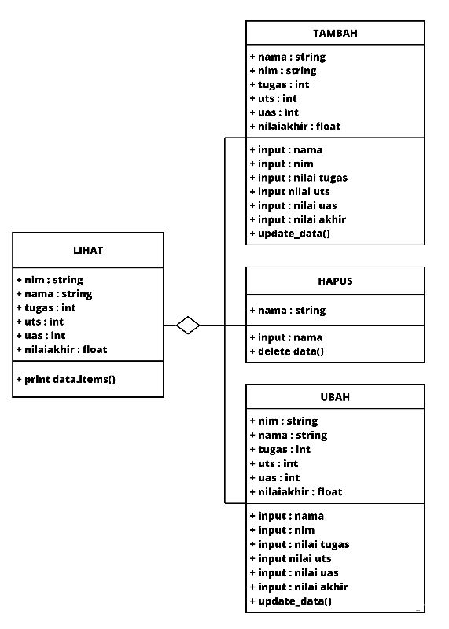

# praktikum8

## Buat program sederhana dengan mengaplikasikan penggunaan class. Buatlah class untuk menampilkan daftar nilai mahasiswa, dengan ketentuan:

### 1. Method tambah() untuk menambah data
### 2. Method tampilkan() untuk menampilkan data
### 3. Method hapus(nama) untuk menghapus data berdasarkan nama
### 4. Method ubah(nama) untuk mengubah data berdasarkan nama
### 5. Buat diagram class, flowchart dan penjelasan programnya pada README.md.
### 6. Commit dan push repository ke github

## Program

## Hasil Running

## Diagram Class

## Flowchart

